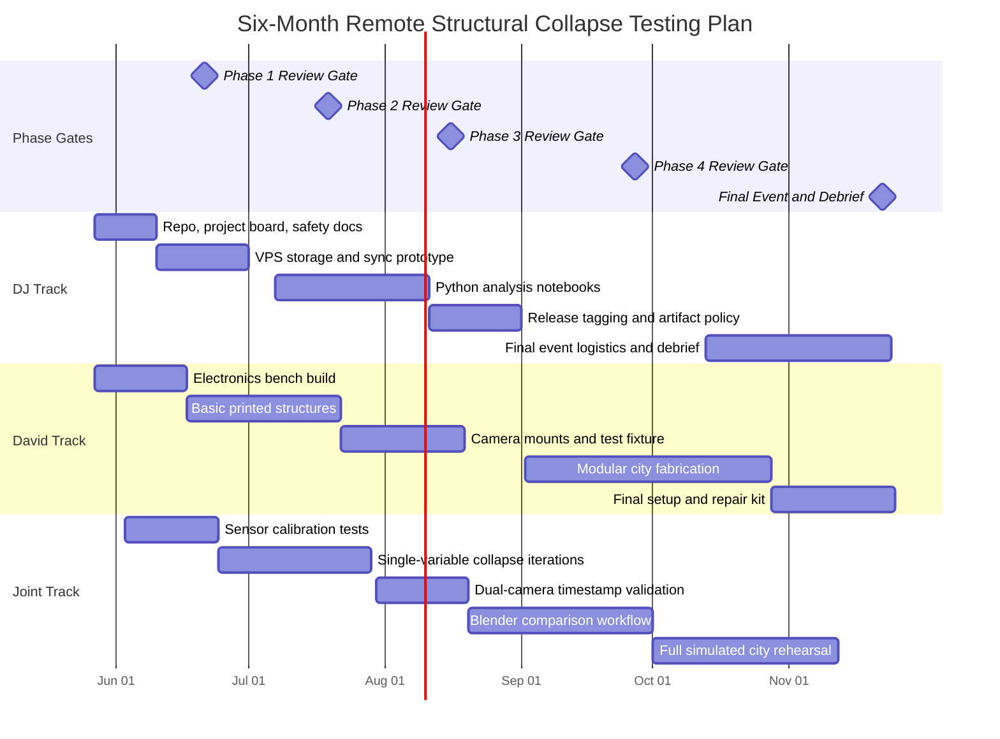
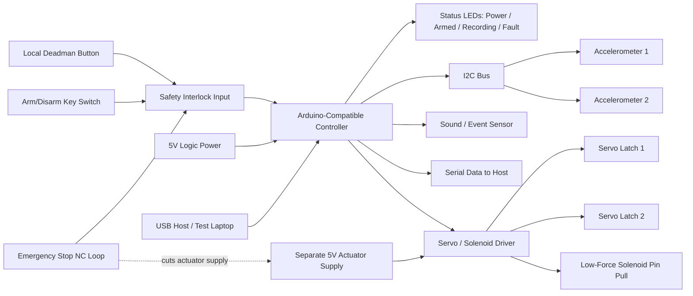
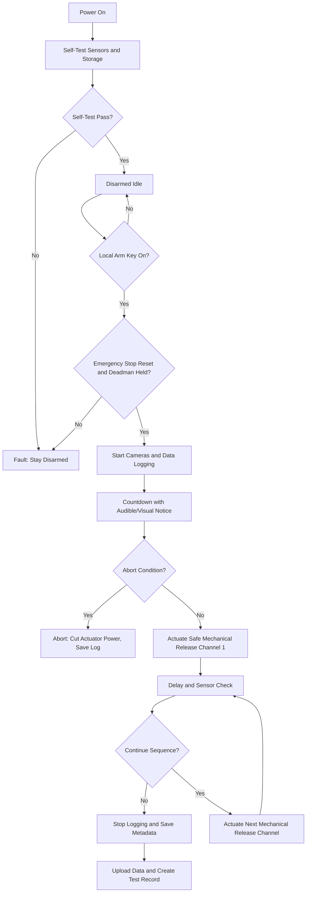
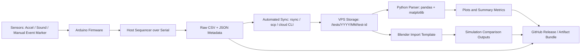
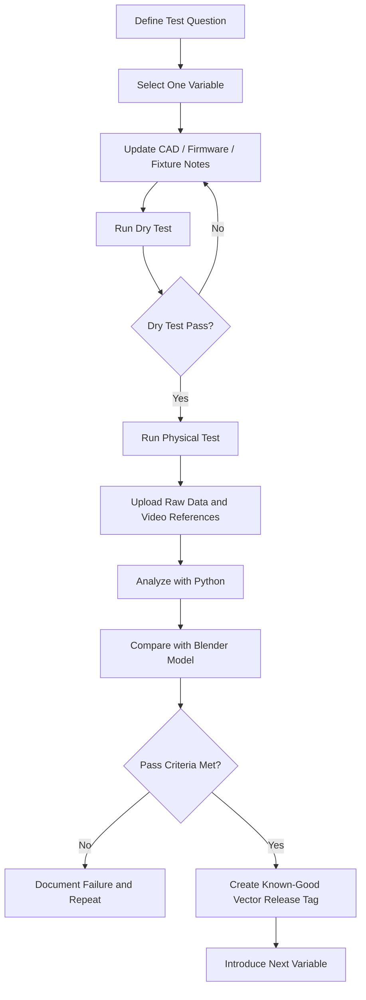

# Six-Month Project Plan: Remote Structural Collapse Testing and Simulation Project

**Prepared for:** DJ, Dayton, Ohio, and David, Detroit, Michigan  
**Prepared by:** Manus AI  
**Date:** May 26, 2026  
**Budget cap:** **$500 total**, split as **$250 DJ / $250 David**  
**Document status:** Working reference document suitable for GitHub-based collaboration

## One-Page Executive Summary

This document provides a comprehensive six-month project plan for a remote-first structural collapse testing project between DJ in Dayton, Ohio, and David in Detroit, Michigan. The plan preserves the original goals of collaborative fabrication, Arduino-based sensing, synchronized camera observation, data logging, GitHub release control, Python analytics, and Blender simulation. However, it intentionally scopes the physical testing system to **non-pyrotechnic, non-explosive, low-energy mechanical collapse methods** such as servo-triggered pin releases, solenoid latch releases, gravity-loaded test rigs, elastic-band stored-energy fixtures, and pre-scored 3D printed or concrete-like test structures.

> **Safety and compliance boundary:** This plan does not include instructions for modifying fireworks, building ignition circuits, sequencing pyrotechnic devices, remotely initiating energetic materials, or placing charges in structures. If any future work involves fireworks, explosives, pyrotechnics, blasting, or demolition charges, that work should be handled only by qualified, licensed professionals with written authorization from the property owner and the relevant authority having jurisdiction. The technical plan below is written as a safe alternative that supports experimentation, measurement, simulation, and collaboration without providing actionable explosive or ignition guidance.

The six-month program is organized into **five gated phases**. Each phase has a review gate and clear go/no-go criteria before the team proceeds. Phase 1 establishes the safe electronics, sensor, and remote collaboration foundation. Phase 2 validates simple 3D printed structures and predictable weak-point geometry. Phase 3 adds dual-camera observation and synchronized playback. Phase 4 builds the automated data pipeline from Arduino sensor output to VPS storage, Python analysis, Blender simulation, and GitHub artifacts. Phase 5 builds a modular simulated city environment using 3D printed structures and safe mechanical release triggers.

The operating principle is **remote-first but locally safe**. DJ owns project management, repository administration, VPS/data workflow, testing coordination, documentation, and Ohio site logistics. David owns most fabrication, 3D printing, resin detail printing, routing or jig work, concrete-like casting, and Arduino hardware assembly. Both collaborate on CAD, firmware, analytics, and simulation review. Remote access is used for observation, data review, and software operation, but any physical actuation must remain under local human supervision with a hardware lockout, emergency stop, clear test area, and pre-test checklist.

The project is feasible under the $500 cap if the team minimizes duplicate hardware, relies on one shared physical test rig, uses inexpensive sensors, reuses existing computers where possible, and avoids unnecessary specialty components. The recommended BOM totals approximately **$468**, leaving about **$32 contingency**. The largest costs are cameras, Arduino-compatible electronics, 3D printing materials, sensors, wiring, and casting supplies.

## 1. Project Scope and Safety Boundary

The project goal is to build a remote-collaborative testing and analytics workflow for small-scale structural collapse models. The safe version of the project uses controlled mechanical release and non-combustion test methods to simulate localized support failure. These methods allow the team to measure collapse behavior, refine weak-point geometry, synchronize sensor and camera data, and compare physical results with Blender rigid-body simulations.

| Original project intent | Safety-compliant implementation in this plan |
|---|---|
| Charge and igniter testing | **Servo, solenoid, or pin-pull release testing** with no pyrotechnic or combustion components |
| Firing sequence logic | **Actuation sequence logic** for low-voltage mechanical devices with manual lockout and emergency stop |
| Explosive demolition effects | **Support-removal, gravity-load, spring/elastic impulse, or weighted-drop simulations** |
| Firecracker or pyrotechnic materials | **No pyrotechnic materials**; use 3D printed components, sand, clay, plaster, small concrete coupons, and mechanical fixtures |
| Underground pit charges | **Subsurface void-collapse simulation** using pre-formed cavities, removable plugs, or servo-operated trap doors |
| Remote firing | **Remote observation and software-controlled logging only**; physical actuation requires local authorization and visible safe-area confirmation |

The plan uses established documentation practices. Arduino is appropriate for electronics prototyping because its official documentation covers hardware, IDE, cloud, and programming workflows.[1] GitHub releases are suitable for locking known-good combinations because releases are based on Git tags that identify a specific point in repository history.[2] Semantic Versioning is used because it defines a consistent `MAJOR.MINOR.PATCH` scheme for communicating compatibility and change scope.[3]

## 2. Governance, Roles, and Communication Cadence

DJ and David should run the project like a small engineering program rather than a series of isolated experiments. The work should be documented in a shared GitHub repository, with short weekly reviews and formal phase gates at the end of each project phase. Since only one physical rig is recommended, the team should prioritize remote visibility, reproducible test checklists, and artifact capture.

| Role | Primary responsibilities | Key outputs |
|---|---|---|
| **DJ, Ohio** | Project management, GitHub administration, VPS setup, data workflow, test calendar, site coordination, documentation quality control, final event logistics | Project board, release tags, VPS folders, test reports, safety checklists, final event plan |
| **David, Michigan** | Primary fabrication, 3D printing, resin details, router or jig work, concrete-like casting, Arduino hardware assembly, camera rig setup | Test structures, fixtures, electronics enclosure, camera mounts, fabrication notes, build photos |
| **Both** | CAD review, firmware review, actuation sequencing, sensor calibration, analytics interpretation, Blender model review | Pull requests, design decisions, tagged known-good vectors, debrief notes |

The recommended meeting cadence is a 30-minute weekly build review, a 15-minute pre-test checklist review before each physical test, and a 45-minute phase-gate review at the end of each phase. Each review should end with one decision: **go**, **no-go**, or **repeat phase with changes**.

## 3. Six-Month Gantt Chart

The Gantt chart below assumes a 26-week schedule. Several tracks run in parallel because DJ and David can work independently on documentation, cloud workflow, CAD, fabrication, and analytics.



## 4. Phase Plan with Review Gates

### Phase 1: Electronics, Sensors, and Safe Actuation Foundation

Phase 1 establishes a controlled bench system that can record sensor data, trigger low-energy mechanical devices, and produce synchronized timestamps. The physical output should be limited to a servo moving a latch, a solenoid pulling a pin, or an LED standing in for an actuator. The team should not proceed to structures until the data and safety controls are reliable.

| Item | Description |
|---|---|
| **Duration** | Weeks 1–4 |
| **Primary owner** | David for bench hardware; DJ for repository, test templates, and data storage |
| **Core work** | Build Arduino-compatible sensor rig; add accelerometer, sound sensor, status LEDs, emergency stop, arm/disarm key switch, and actuator test output; validate timestamped CSV/JSON logging |
| **Safe actuation method** | Servo latch, solenoid pin pull, or LED-only dry-run output |
| **Deliverables** | Firmware v0.1.0, wiring diagram, bench test report, safety checklist, first GitHub release tag |
| **Pass criteria** | Ten consecutive dry-run sequences complete with correct timestamps, correct abort response, no unexpected actuator motion, and complete data files |
| **No-go criteria** | Any uncontrolled motion, inconsistent timestamps, missing abort behavior, electrical overheating, or undocumented wiring changes |

### Phase 2: Basic 3D Printed Structure Tests

Phase 2 introduces simple towers and beams with designed weak points. The team should introduce only one new variable at a time: wall thickness, notch depth, infill percentage, support geometry, material type, or trigger location. Each iteration should be documented with a CAD revision, firmware version, sensor configuration, and physical test result.

| Item | Description |
|---|---|
| **Duration** | Weeks 5–9 |
| **Primary owner** | David for printing and fixtures; both for CAD and test interpretation |
| **Core work** | Print simple towers, supports, and bridge-like sections; release a support using a servo or removable pin; measure collapse initiation, direction, and repeatability |
| **Deliverables** | CAD v0.2.x, test structure library, sensor dataset, collapse classification notes, Phase 2 report |
| **Pass criteria** | Structure fails along predicted weak point in at least 8 of 10 comparable tests, with complete sensor and video records |
| **No-go criteria** | Uncontrolled projectile behavior, unpredictable failure direction, repeated missing data, fixture instability, or unsafe operator positioning |

### Phase 3: Dual-Camera Observation and Playback

Phase 3 adds a close-up camera and a wide-angle camera so DJ and David can observe tests together and compare physical collapse behavior with sensor timestamps. IP cameras, webcams connected to a local computer, or inexpensive used phones can all work if the timestamps are reliable.

| Item | Description |
|---|---|
| **Duration** | Weeks 10–13 |
| **Primary owner** | DJ for remote viewing workflow; David for camera mounts and physical setup |
| **Core work** | Mount cameras, define views, test lighting, synchronize video timestamps with Arduino logs, create playback naming convention |
| **Deliverables** | Camera placement guide, timestamp validation report, video storage folder convention, Phase 3 release tag |
| **Pass criteria** | Both views capture the full test area; timestamps align within one video frame or agreed tolerance; files upload without manual SD-card transfer |
| **No-go criteria** | Blind spots in failure direction, unreliable streaming, missing local recording backup, or network access that bypasses local safety authorization |

### Phase 4: Data Capture, Analytics, and Blender Workflow

Phase 4 turns the project from a hardware experiment into an engineering workflow. Sensor data should move automatically from the test computer to VPS storage, then into Python scripts that generate plots and summary statistics. Blender is used for model comparison and visualization. Blender includes physics features such as rigid body workflows, and its Python API can support automation for repeatable scene creation and import workflows.[4]

| Item | Description |
|---|---|
| **Duration** | Weeks 14–18 |
| **Primary owner** | DJ for VPS, Python, and GitHub artifacts; both for simulation interpretation |
| **Core work** | Standardize CSV/JSON formats, automate upload, parse sensor logs with Python, create plots, import test metadata into Blender scenes |
| **Deliverables** | Data schema v0.4.0, Python parser, sample plots, Blender scene template, GitHub release artifact bundle |
| **Pass criteria** | A completed test produces a raw data file, processed plot, metadata JSON file, video references, and simulation comparison without manual file shuffling |
| **No-go criteria** | Data cannot be traced to a test ID, scripts require undocumented manual steps, or release artifacts cannot reproduce prior results |

### Phase 5: Full Simulated City Environment Build

Phase 5 integrates modular structures into a full simulated city environment. The model should include aboveground buildings, bridge or tower elements, and underground-style void-collapse modules. The underground module should be simulated with safe mechanisms such as removable plugs, trap doors, or collapsible supports rather than charges or energetic materials.

| Item | Description |
|---|---|
| **Duration** | Weeks 19–26 |
| **Primary owner** | David for city fabrication; DJ for final logistics, release governance, and debrief documentation |
| **Core work** | Build modular baseplates, print buildings, cast small blocks, create weak points, run rehearsal tests, choreograph safe actuation sequence, compare against Blender predictions |
| **Deliverables** | Final city model, rehearsal dataset, final event checklist, release tag `v1.0.0`, final debrief |
| **Pass criteria** | Final rehearsal completes with all cameras, sensors, logs, and actuation steps captured; collapse directions stay inside marked test boundary; cleanup plan is ready |
| **No-go criteria** | Any physical hazard outside the test boundary, fixture instability, weather or site risk, missing local supervisor, nonfunctional emergency stop, or incomplete documentation |

## 5. Bill of Materials by Phase

The BOM below is intentionally limited to safe electronics, fabrication, sensing, camera, and data-management items. Prices are planning estimates and should be confirmed before purchase. The team should buy only what is needed for the next phase after passing the prior review gate.

| Phase | Item | Example supplier | Qty. | Est. unit cost | Est. phase cost | Running total |
|---|---|---:|---:|---:|---:|---:|
| 1 | Arduino Uno R3-compatible board | Amazon, Adafruit, SparkFun | 1 | $18 | $18 | $18 |
| 1 | Breadboard, jumper wires, resistors, LEDs | Amazon, Adafruit | 1 kit | $18 | $18 | $36 |
| 1 | MPU-6050 accelerometer module | Amazon, SparkFun alternatives | 2 | $7 | $14 | $50 |
| 1 | Sound sensor module | Amazon, Adafruit alternatives | 1 | $8 | $8 | $58 |
| 1 | MicroSD or USB serial logging module | Amazon, Adafruit | 1 | $12 | $12 | $70 |
| 1 | Emergency stop button, key switch, project box | Amazon, McMaster-Carr | 1 set | $28 | $28 | $98 |
| 1 | 5V relay module for non-energetic loads or MOSFET driver module | Amazon, SparkFun | 1 | $10 | $10 | $108 |
| 1 | Small servo motors for latch release | Amazon, Adafruit | 3 | $6 | $18 | $126 |
| 2 | PLA filament, 1 kg | Amazon, Micro Center | 1 | $22 | $22 | $148 |
| 2 | M3 screws, inserts, small hinges, magnets | Amazon, McMaster-Carr | 1 kit | $25 | $25 | $173 |
| 2 | Sand, plaster, small aggregate, disposable molds | Local hardware store | 1 set | $30 | $30 | $203 |
| 2 | Fixture base board and clamps | Local hardware store | 1 set | $30 | $30 | $233 |
| 3 | Two 1080p webcams or low-cost IP cameras | Amazon | 2 | $35 | $70 | $303 |
| 3 | Camera tripods or printed mounts | Amazon / printed | 2 | $12 | $24 | $327 |
| 3 | Lighting, extension cord, power strip | Local hardware store | 1 set | $28 | $28 | $355 |
| 4 | VPS storage or small cloud instance | Existing VPS or low-cost provider | 3 months | $6 | $18 | $373 |
| 4 | Backup USB drive or high-endurance microSD | Amazon | 1 | $18 | $18 | $391 |
| 4 | Misc. network cable, labels, cable ties | Amazon | 1 set | $14 | $14 | $405 |
| 5 | Additional PLA or resin for city details | Amazon, Micro Center | 1 | $30 | $30 | $435 |
| 5 | Additional casting supplies and pigments | Local hardware store | 1 set | $25 | $25 | $460 |
| 5 | Cleanup supplies, PPE replacements, storage bins | Local hardware store | 1 set | $8 | $8 | $468 |
|  | **Contingency remaining** |  |  |  |  | **$32** |

DJ should cover the VPS, repository administration, documentation, cloud storage, and a portion of camera/network purchases. David should cover most fabrication supplies, Arduino hardware, sensors, and physical rig materials. Because the total is close to the cap, all optional upgrades should be deferred until after Phase 3.

## 6. Safe Arduino Wiring Schematic

The schematic below is a safe, low-voltage control layout for sensors and non-pyrotechnic mechanical actuators. It explicitly excludes igniters, fireworks, energetic materials, and any circuit intended to heat, ignite, or initiate a charge.



The wiring should be built so the emergency stop physically removes actuator power, not merely requests a software stop. The controller should treat any open interlock, missing deadman signal, or unexpected sensor state as a fault and return to a disarmed state.

## 7. Safe Actuation Sequence Flowchart

The sequence below replaces prohibited firing logic with safe mechanical actuation logic. The physical test should not start unless the local operator confirms that the area is clear, cameras are recording, sensors are logging, and the emergency stop has been tested.



Abort conditions include emergency stop activation, local deadman release, camera failure, missing sensor data, unsafe movement, unexpected human or animal presence, fixture instability, rain or wind affecting the test, or loss of local operator confirmation.

## 8. End-to-End Data Pipeline

The data pipeline should be designed so test results are never trapped on one device. Each test should create a unique test ID, such as `T2026-07-18-001`, and all sensor files, metadata, camera references, plots, and simulation outputs should use that ID.



Recommended data formats are simple and durable. Sensor time-series should use CSV because it is easy to inspect and works well with Python data tools. Test metadata should use JSON because it can store nested information such as firmware version, CAD revision, actuator configuration, camera filenames, environmental conditions, and operator notes.

| File | Format | Naming example | Required fields |
|---|---|---|---|
| Sensor log | CSV | `T2026-07-18-001_sensors.csv` | `timestamp_ms`, `sensor_id`, `x`, `y`, `z`, `sound_level`, `event_marker` |
| Metadata | JSON | `T2026-07-18-001_metadata.json` | `test_id`, `date`, `operator`, `firmware_version`, `cad_revision`, `structure_id`, `actuator_config`, `camera_files`, `result_summary` |
| Plot bundle | PNG/PDF | `T2026-07-18-001_plot_accel.png` | Automatically generated from CSV |
| Simulation scene | `.blend` | `T2026-07-18-001_compare.blend` | Linked to CAD and measured data |
| Test report | Markdown | `T2026-07-18-001_report.md` | Purpose, setup, result, pass/fail, lessons learned |

## 9. GitHub Repository Structure and Release Strategy

The repository should be treated as the single source of truth. GitHub releases can package a tested combination of firmware, CAD, test data, simulation files, and documentation because releases are tied to tags at specific points in repository history.[2] Semantic Versioning should be used for firmware, data schemas, and tooling because it defines how major, minor, and patch increments communicate changes.[3]

```text
remote-collapse-testing/
├── README.md
├── SAFETY.md
├── CHANGELOG.md
├── docs/
│   ├── project-plan.md
│   ├── phase-gates/
│   ├── checklists/
│   └── diagrams/
├── firmware/
│   ├── arduino_safe_actuator_controller/
│   └── libraries-notes.md
├── host-tools/
│   ├── sequencer/
│   ├── sync/
│   └── analytics/
├── cad/
│   ├── structures/
│   ├── fixtures/
│   └── city-modules/
├── sensor-data/
│   ├── raw/
│   ├── processed/
│   └── sample-data/
├── sim-models/
│   ├── blender-templates/
│   └── comparisons/
├── camera/
│   ├── placement-guides/
│   └── sync-tests/
└── releases/
    └── known-good-vectors/
```

The branching strategy should be simple. The `main` branch contains only reviewed, known-good work. The `dev` branch integrates upcoming changes. Feature branches are named by domain, such as `feature/phase2-tower-v02`, `feature/python-parser`, or `feature/camera-sync`. Each known-good vector should be captured with a release tag.

| Release element | Example | Purpose |
|---|---|---|
| Firmware version | `firmware v0.4.2` | Identifies controller behavior used in the test |
| CAD revision | `tower-A rev C` | Identifies the exact model geometry |
| Data schema | `schema v0.3.0` | Identifies the CSV/JSON structure |
| Fixture configuration | `fixture v0.2.1` | Identifies mechanical setup |
| Sensor configuration | `accel-2x-400hz` | Identifies measurement setup |
| Release tag | `kgv-2026-08-21-towerA-v0.4.2` | Locks the complete known-good vector |

## 10. Concrete-Like and Casting Plan

The project can use small concrete-like coupons, plaster blocks, mortar samples, or sand-cement practice blocks to study brittle fracture and collapse behavior. Work should remain small-scale and low-energy. For early phases, plaster or mortar is easier to cast, cure, and break safely than full concrete.

| Phase | Casting material | Batch size | Cure target | Test quantity | Notes |
|---|---|---:|---:|---:|---|
| 2 | Plaster or mortar coupons | 1–2 lb | 24–72 hours for handling, longer for consistency | 6–10 | Use for weak-point geometry only |
| 4 | Small mortar/concrete-like blocks | 5–10 lb | Minimum 7 days; ideally 28 days for repeatable strength | 6–12 | Record exact mix, water, temperature, and cure time |
| 5 | Modular base and city blocks | 10–20 lb total | Minimum 7 days; ideally 28 days for final event pieces | 10–20 | Keep modules small enough to handle and contain |

For concrete-like blocks, the team may use a lean planning ratio such as **1 part cement, 2 parts sand, and 3 parts small aggregate**, with low water added gradually until workable. This ratio should be treated as a documentation baseline rather than a structural engineering specification. Pre-formed cavities for safe void-collapse simulations should be created with removable dowels, foam inserts, or PVC plugs that are removed before testing. The cavities should not be used for pyrotechnic materials or energetic charges.

## 11. Iteration Loop and Known-Good Vector Framework

The team should begin with the simplest possible test: one sensor, one static object, one data file, and no moving structure. After the baseline is established, each new iteration should introduce only one variable. This prevents the team from confusing geometry effects, sensor errors, firmware behavior, and fixture instability.



A known-good vector is a tested combination of firmware, CAD, fixture, sensor configuration, data schema, camera setup, and test procedure that met its pass criteria. Once tagged, it should not be overwritten. If a better version is created, it should receive a new tag.

## 12. Risk Register

The risk register focuses on safe mechanical testing, remote collaboration, and data integrity. It intentionally excludes operational guidance for pyrotechnics or explosives.

| Risk | Likelihood | Impact | Mitigation | Go/no-go trigger |
|---|---:|---:|---|---|
| Unexpected structure failure direction | Medium | High | Use containment box or backstop, mark exclusion area, use small models, keep observers out of line of travel | No-go if structure can leave marked area |
| Fragmentation from brittle materials | Medium | Medium | Use eye protection, gloves, transparent shield, small sample sizes, lower stored energy | No-go if fragments escape shield |
| Pinch or snap hazard from elastic or spring elements | Medium | Medium | Use covers, low-force mechanisms, local deadman, no hands near mechanism while armed | No-go if mechanism cannot be reset safely |
| Electrical fault or overheating | Low | High | Fuse actuator supply, separate logic and actuator power, emergency stop cuts actuator supply, inspect wiring before each test | No-go if wires heat, smell, or discolor |
| Network failure during remote observation | Medium | Low | Local operator retains authority; record locally; remote team cannot override local safety | No-go for remote-only actuation |
| Missing sensor data | Medium | Medium | Dry-run logging before test, file naming convention, local backup, automated upload | No-go if logging fails before test |
| Camera blind spots | Medium | Medium | Use wide and close cameras, verify frame before test, add lighting | No-go if test area is not fully visible |
| Weather or outdoor site issues | Medium | Medium | Indoor bench tests when possible; final event only in calm, dry conditions | No-go for rain, high wind, poor visibility, or unstable surface |
| Manual procedure drift | Medium | Medium | Printed checklist, two-person verbal confirmation, GitHub issue template | No-go if checklist is incomplete |
| Budget overrun | Medium | Medium | Gate purchases by phase, reuse hardware, defer upgrades | No-go if next phase exceeds remaining budget without explicit approval |

## 13. Final Event Logistics

The final event should be treated as a controlled demonstration of the safe simulated city environment. It should take place on private property only with the property owner’s permission, stable ground, a defined test boundary, and a cleanup plan. If any regulated activity is contemplated in the future, the team should contact the relevant local authority having jurisdiction before purchasing materials or scheduling the event.

| Logistics area | Requirement |
|---|---|
| Site setup | Flat surface, clear test boundary, backstop or containment where appropriate, stable table or ground board |
| Observer positioning | Observers outside the marked area and outside the expected failure direction; cameras placed before arming mechanisms |
| PPE | Safety glasses, hearing protection if using loud mechanical impacts, gloves for handling rough fragments, closed-toe shoes |
| Fire readiness | Keep a general-purpose extinguisher and water source available for ordinary workshop risks, even though the plan excludes pyrotechnics |
| Weather contingency | Do not run outdoor tests in rain, high wind, poor visibility, or unstable ground conditions |
| Camera placement | One wide shot covering the whole city and one close shot on the primary failure zone |
| Data readiness | Test ID created, clocks synchronized, sensors dry-run checked, local storage available, upload path confirmed |
| Cleanup | Collect all fragments, remove trip hazards, photograph final state, record debrief notes before teardown |
| Debrief | Compare predicted vs. actual failure, identify next design improvement, tag final release artifacts |

## 14. Phase-by-Phase Success Metrics

| Phase | Success metric | Explicit pass criterion |
|---|---|---|
| 1 | Timing and logging reliability | Ten consecutive dry-run sequences complete with expected event order and no missing logs |
| 1 | Safety control response | Emergency stop, disarm switch, and deadman each stop actuator output during every test case |
| 2 | Collapse repeatability | Structure fails along predicted weak point in at least 8 of 10 comparable tests |
| 2 | Single-variable discipline | Each test changes only one documented variable from the prior known-good vector |
| 3 | Camera coverage | Wide and close cameras capture all relevant motion with no blocked view |
| 3 | Timestamp sync | Video and sensor data align within the team’s defined tolerance |
| 4 | Automated workflow | Raw data, plots, metadata, and simulation comparison are generated without manual SD-card transfer |
| 4 | Reproducibility | A teammate can reproduce analysis from the GitHub artifacts and documented commands |
| 5 | Integrated demonstration | Final rehearsal and final event complete with all data, video, and debrief artifacts captured |
| 5 | Safety performance | No fragments, moving parts, or materials leave the defined test boundary |

## 15. Recommended Next Actions

The team should begin by creating the GitHub repository, adding `README.md`, `SAFETY.md`, and `docs/project-plan.md`, and opening issues for Phase 1 tasks. David should assemble the electronics bench with LED-only outputs first, while DJ configures the VPS folder structure and test ID naming convention. The first formal milestone should be a Phase 1 dry-run release tag that proves the workflow before any structure is tested.

| Week | Immediate action | Owner | Output |
|---:|---|---|---|
| 1 | Create repository and project board | DJ | Repo, issues, branch rules |
| 1 | Order Phase 1 parts only | David | Electronics kit and enclosure |
| 2 | Build LED-only bench rig | David | Safe dry-run controller |
| 2 | Define CSV and JSON schema | DJ | `docs/data-schema.md` |
| 3 | Add sensors and dry-run scripts | Both | First raw datasets |
| 4 | Conduct Phase 1 review gate | Both | Go/no-go decision and release tag |

## References

[1]: https://docs.arduino.cc/ "Arduino Documentation"  
[2]: https://docs.github.com/en/repositories/releasing-projects-on-github/about-releases "GitHub Docs: About releases"  
[3]: https://semver.org/ "Semantic Versioning 2.0.0"  
[4]: https://docs.blender.org/api/current/index.html "Blender Python API Documentation"
